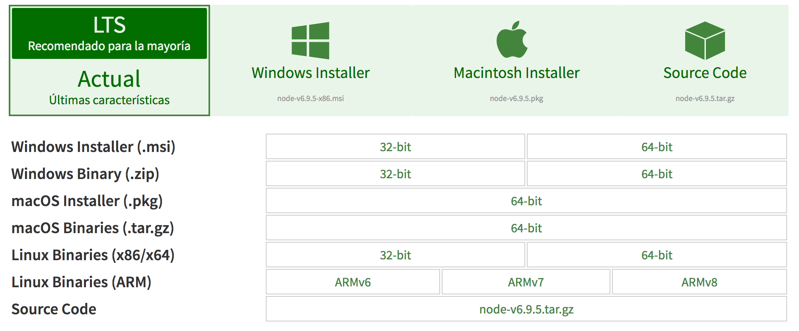
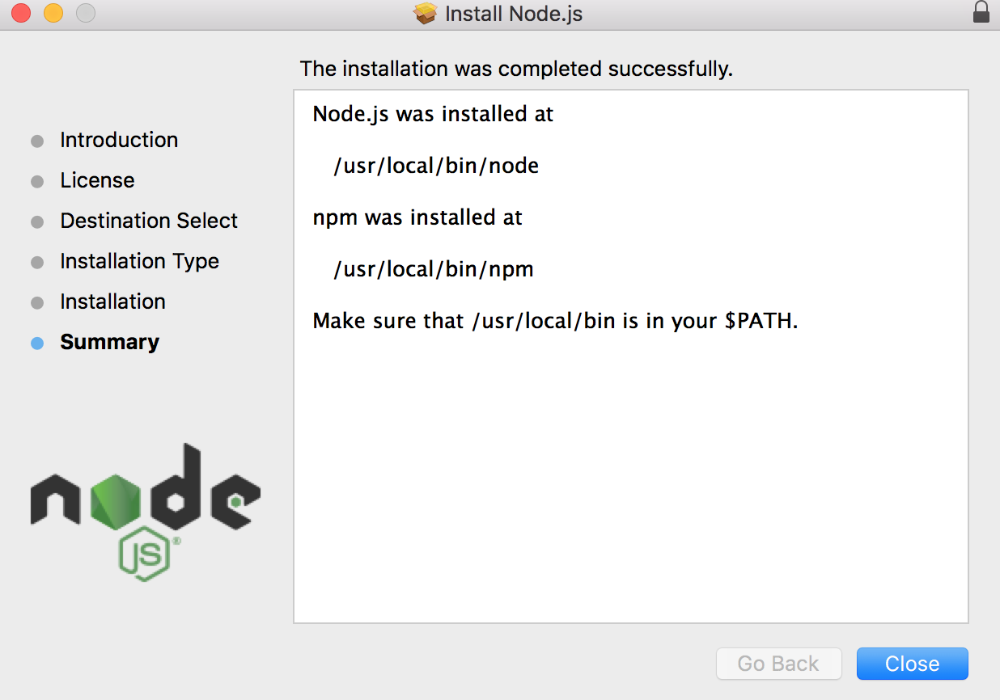
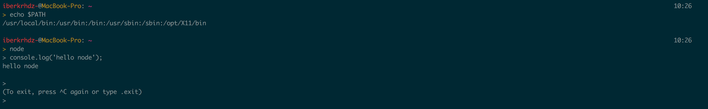

# **NodeJS**
Node.js® es un entorno de ejecución para JavaScript construido con el motor de JavaScript V8 de Chrome. Node.js usa un modelo de operaciones E/S sin bloqueo y orientado a eventos, que lo hace liviano y eficiente. El gestor de paquetes de Node.js, npm, es el ecosistema mas grande de librerías de código abierto en el mundo.

En su página web [www.nodejs.org](www.nodejs.org), podemos encontrar las diversas formas de descarga para las distintas plataformas.

Como se observa en la imagen, en la web se muestran las dos versiones de descargas, la recomendada, estable, y una actual que contiene las últimas características. Además de diferencian diversos sistemas para los que se encuentra disponible este entorno de ejecución de JavaScript. Por último, para cada uno de los sistemas aparecen distintos tipos de descarga en función de dicho sistema.

## **Intalación NodeJS en MacOS**

En MacOS la instalación de NodeJS puede ser realizada mediante la descarga y posterior instalación de un paquete que contiene tanto el entorno de ejecución para JavaScript como el gestor de paquetes "npm".

En la imagen se observa lo ya mencionado anteriormente, viéndose como ya ha sido instalado el paquete que contiene nodeJS y el gestor de paquetes npm.

Para comprobar que la instalación ha tenido exito, ejecutamos `node` y una vez dentro del intérprete `console.log('hello node')`. A continuación se muestra una imagen con la salida para comprobar que ha sido instalado correctamente.

