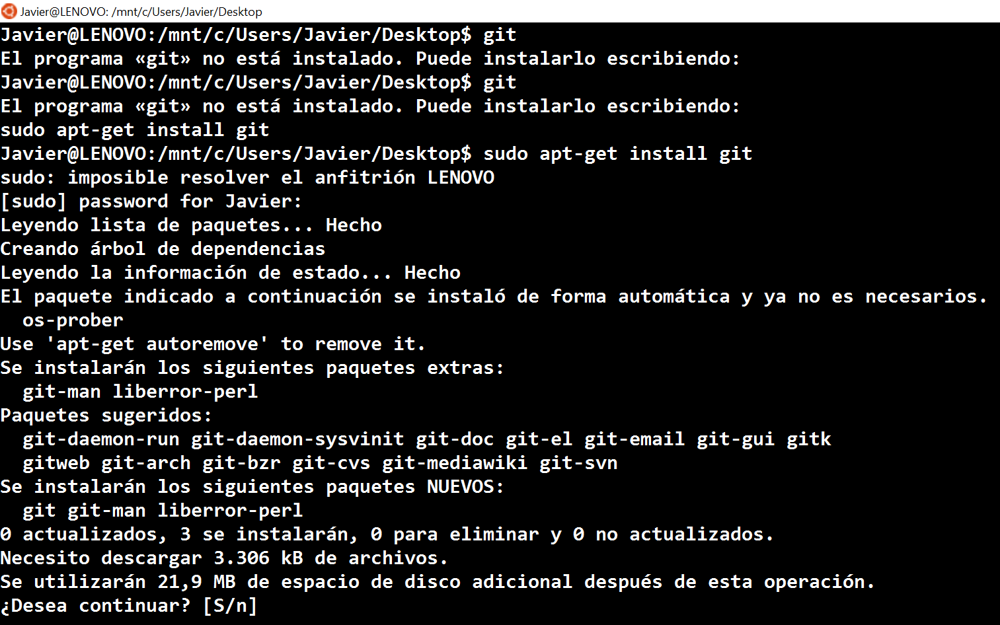

# **[Git](Chapter2-Git.md)**
## Instalación de Git en Linux

1. Ejecuta el siguiente comando.
```bash
sudo apt-get install git
```
2. El comando produce la siguiente salida.



3. Para instalar git escribe `s` y pulsa enter, o simplemente pulsa enter para instalar(la opción por defecto en este caso es si).

4. Comprobamos que git funciona correctamente ejecutando el comando `git`.
