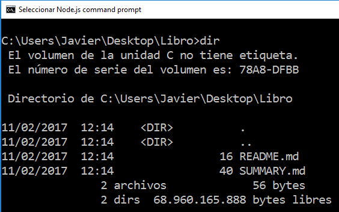

# **Gitbook**

**Gitbook** es una herramienta para crear documentación de proyectos, libros técnicos y apuntes de clase usando [Markdown](Chapter4-Markdown.md). Permite incluir ejemplos y ejercicios interactivos(mediante JavaScript, por ejemplo). 

El libro creado puede publicarse en Github, en [www.gitbook.com](https://www.gitbook.com/) o cualquier otro hosting web. 

## Instalando Gitbook 

Gitbook necesita del gestor de paquetes de node.js para ser instalado, si no tienes nodejs instalado ve primero al [capitulo 1 de este tutorial](Chapter1-NodeJS.md) para saber como se instala.

Abre la consola de nodejs y ejecuta: 
```nodejs 
npm install -g gitbook-cli
```
Una vez tenemos instalado gitbook vamos a crear un libro siguiendo los siguientes pasos:
1. ejecuta `gitbook init <nombre-del-libro>`.

* Se crea el libro con el siguiente contenido: 



**README.md** va a contener la introducción de tu libro. 
**SUMMARY.md** va a contener la estructura de tu libro.
```markdown
# Summary

* [Introduction](README.md)
* [Capítulo 1](Capítulo1.md)
* [Capítulo 2](Capítulo2.md)
``` 

2. En el directorio que se acaba de crear(donde se encuentras los **.md**) escribe los capítulos de tu libro con tu editor de texto favorito(recuerda poner la extensión .md a los ficheros).

3. En esta carpeta escribe cada capítulo del libro en un fichero con extensión **.md**(markdown). 

4. Gitbook permite probar tu libro antes de subirlo al repositorio utilizando el siguiente comando: `gitbook serve`.
 