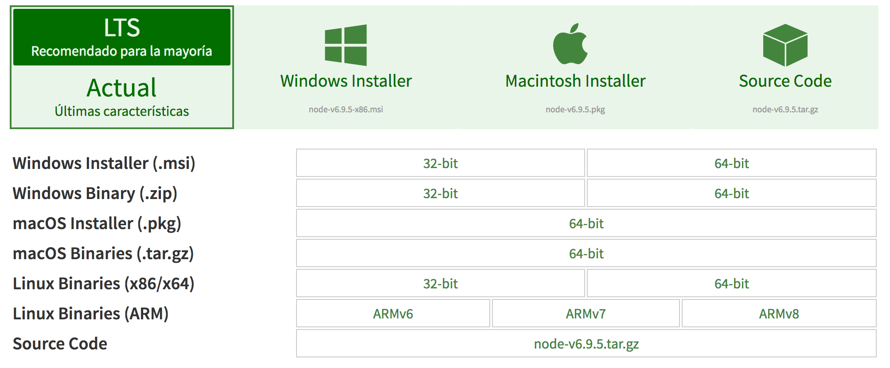

# ** NodeJS **
Node.js® es un entorno de ejecución para JavaScript construido con el motor de JavaScript V8 de Chrome. Node.js usa un modelo de operaciones E/S sin bloqueo y orientado a eventos, que lo hace liviano y eficiente. El gestor de paquetes de Node.js, npm, es el ecosistema mas grande de librerías de código abierto en el mundo.

En su página web [www.nodejs.org](www.nodejs.org), podemos encontrar las diversas formas de descarga para las distintas plataformas.

Como se observa en la imagen, en la web se muestran las dos versiones de descargas, la recomendada, estable, y una actual que contiene las últimas características. Además de diferencian diversos sistemas para los que se encuentra disponible este entorno de ejecución de JavaScript. Por último, para cada uno de los sistemas aparecen distintos tipos de descarga en función de dicho sistema.

A continuación se muestran la manera en la que se puede instalar nodejs en los sistemas Windows, MacOS y Ubuntu.

* [Intalación NodeJS en MacOS.](Chapter1.1-NodeJSMacOS.md)
* [Intalación NodeJS en Windows.](Chapter1.2-NodeJSWindows.md)
* [Intalación NodeJS en Ubuntu.](Chapter1.1-NodeJSUbuntu.md)
