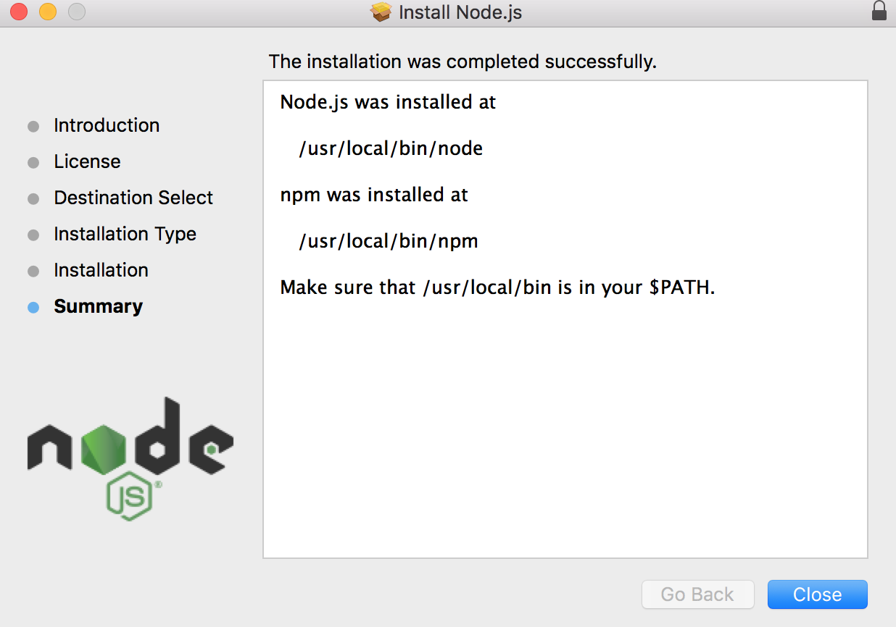
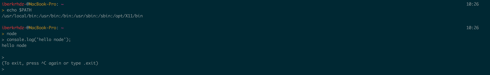

# [**Node JS**](Chapter1.1-NodeJS.md)
## **Intalación NodeJS en MacOS**

En MacOS la instalación de NodeJS puede ser realizada mediante la descarga y posterior instalación de un paquete que contiene tanto el entorno de ejecución para JavaScript como el gestor de paquetes "npm".

En la imagen se observa lo ya mencionado anteriormente, viéndose como ya ha sido instalado el paquete que contiene nodeJS y el gestor de paquetes npm.

Para comprobar que la instalación ha tenido exito, ejecutamos `node` y una vez dentro del intérprete `console.log('hello node')`. A continuación se muestra una imagen con la salida para comprobar que ha sido instalado correctamente.

