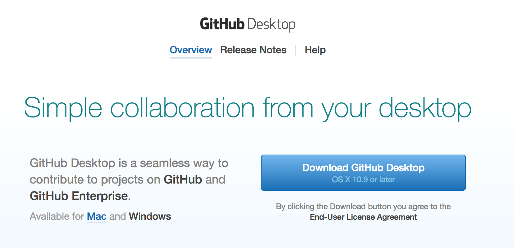
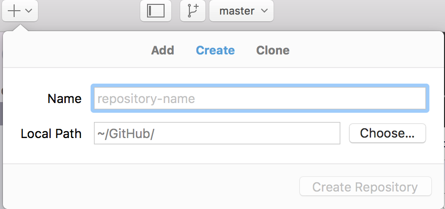
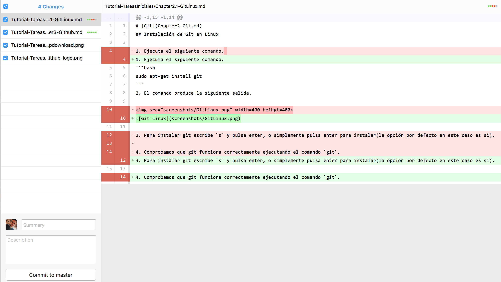
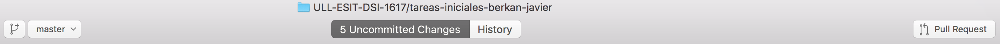

# ** GitHub **

GitHub es una plataforma de desarrollo colaborativo de software para alojar proyectos utilizando el sistema de control de versiones Git. El código se almacena de forma pública, aunque también se puede hacer de forma privada, creando una cuenta de pago.

Para facilitar la gestión de Git y GitHub tenemos la aplicación Github Desktop con la que se podrá realizar de manera más sencilla y visual todas las tareas.

Dicha app puede ser descargada desde la propia página oficial: [https://desktop.github.com/](https://desktop.github.com/)

A continuación se muestran algunas imagenes dentro de la aplicación que simulan algunos comandos propios del controlador de versiones Git en interacción con la plataforma GitHub.

En primer lugar tenemos una sección donde podemos clonar un repositorio o añadir uno nuevo una vez que hemos sincronizado nuestra cuenta de GitHub con la dicha aplicación de escritorio.

.

Una vez clonado un repositorio y realizados algunos cambios sobre este podemos observas una "ventana" con dichos cambios en la cual se preparan y se pueden comitear.

Además aparece una barra en la que podemos ver todo el historial de commits y los cambios de cada unon de estos.

Por último podemos crear ramas y realizar pull request además de push hacia el repositorio alojado en GitHub.

