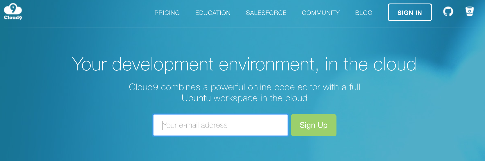
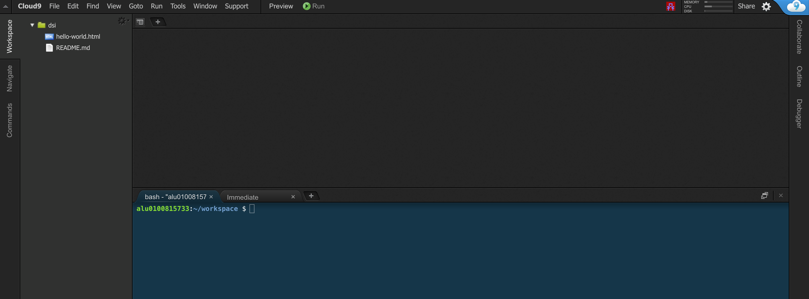

# ** Cloud 9 **

c9 es un entorno de desarrollo online, en la nube, que nos permite no solo editar código sino también administrar un servidor virtual. Cloud9 es una de las mejores opciones que podemos encontrar como entorno de desarrollo en la nube. Básicamentees un programa que se ejecuta sobre el navegador pero que a pesar de ese limitante tiene las funcionalidades más destacadas de un IDE en el que además tenemos un entorno de trabajo real donde podemos poner nuestros programas en ejecución, ya sean sitios web o programas ejecutables.

[https://c9.io/](https://c9.io/)

Iniciaremos sesión enlazando con la cuenta GitHub y ahora ya podemos crear diversos espacios de trabajo para realizar lo anteriormente comentado tal y como se muestra en la siguiente imagen donde se ha creado un espacio para la realización de las prácticas.

