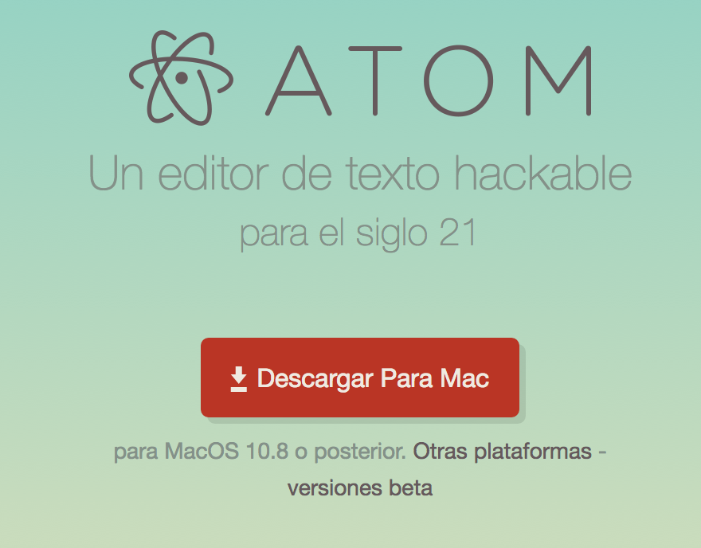
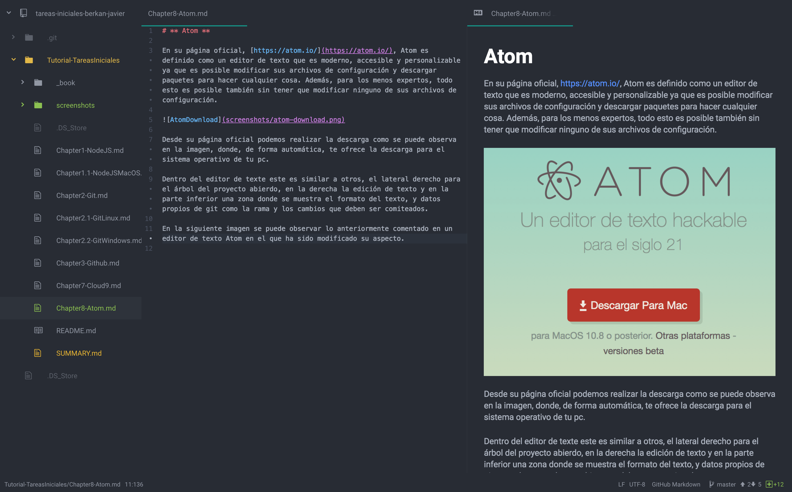

# ** Atom **

En su página oficial, [https://atom.io/](https://atom.io/), Atom es definido como un editor de texto que es moderno, accesible y personalizable ya que es posible modificar sus archivos de configuración y descargar paquetes para hacer cualquier cosa. Además, para los menos expertos, todo esto es posible también sin tener que modificar ninguno de sus archivos de configuración.

Desde su página oficial podemos realizar la descarga como se puede observa en la imagen, donde, de forma automática, te ofrece la descarga para el sistema operativo de tu pc.

Dentro del editor de texte este es similar a otros, el lateral derecho para el árbol del proyecto abierdo, en la derecha la edición de texto y en la parte inferior una zona donde se muestra el formato del texto, y datos propios de git como la rama y los cambios que deben ser comiteados.

En la siguiente imagen se puede observar lo anteriormente comentado en un editor de texto Atom en el que ha sido modificado su aspecto. En este se muestra la edición de este texto markdown más a su derecha su previsualización.

