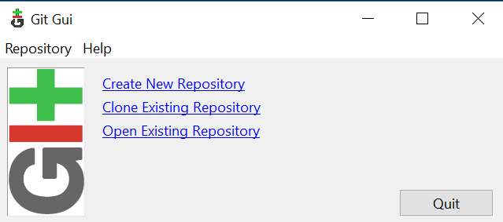

# [Git](Chapter2-Git.md)
## Instalación de Git en Windows

1. Dirígete a la siguiente página: [https://git-scm.com/download/win](https://git-scm.com/download/win) 

2. La descarga comenzará de forma automática.
3. Ejecuta el archivo descargado para proceder a la instalación. 
4. Selecciona las opciones deseadas durante el proceso de instalación. 
5. Una vez finalizada la instalación estarán instalados dos terminales para ejecutar comando de git y una interfaz gráfica para Git(con las opciones por defecto).

* **Git gui**

* **Git CMD**

* **Git Bash**
 
